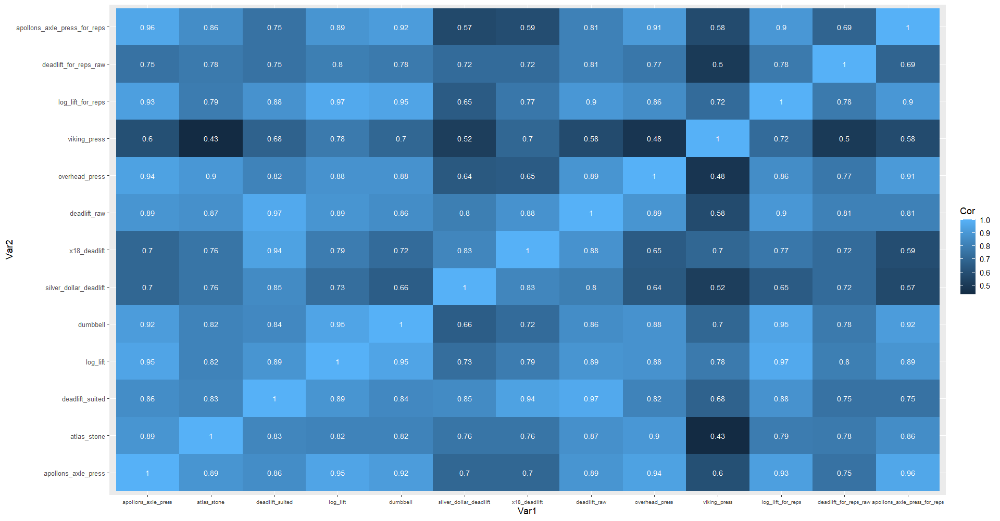
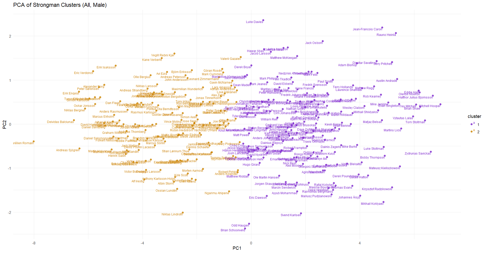
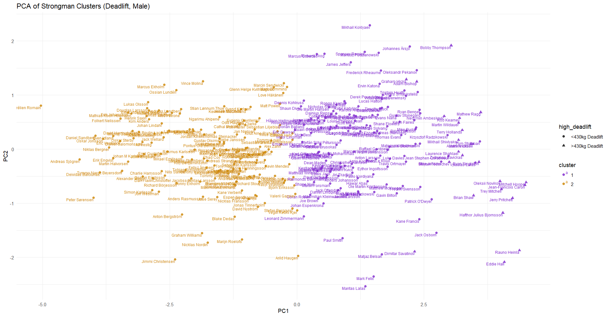
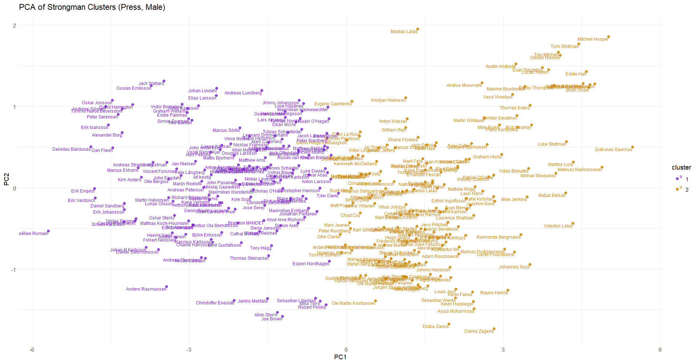
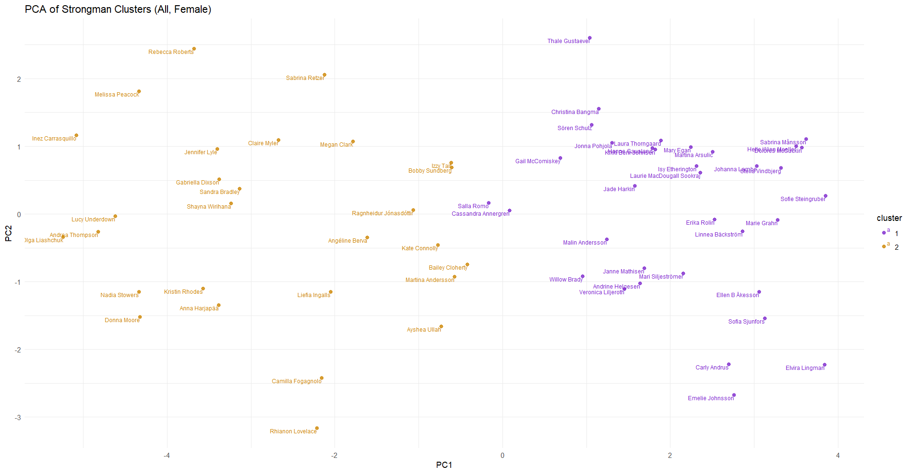

# World's Strongest Man and World's Strongest Woman: Strength Trends & Athlete Profiling 

This repository contains the code and process used to scrape, clean, and analyse data for strong-athletes, including their maximum lifts in a variety of competition exercises. The data was collected from [StrengthResults.com](https://strengthresults.com/statistics/profiles/cdcf-bbb4-4d7f-9306-26a3137e212e), focusing on extracting maximum recorded lifts for exercises of individual athletes. After filtering out teams and incomplete data, the final dataset contains records for 5,557 strongman competitors.

## Workflow Overview

The following steps were used to obtain and clean the data:

1. **Scraping Names and Birthdates (`NameScraper.py`)**  
   The first step was to scrape the names and birthdates of strong-athletes from the website, assuming that athletes listed with birthdates are more likely to have recorded maximum lifts available.
  
2. **Cleaning Names Data (`CleanNameData.py`)**  
   This script was used to remove any non-athlete entries, such as teams, from the list of scraped athlete names.

3. **Scraping Maximum Lifts (`Scraper.py`)**  
   Using Selenium, the script visited each athlete's profile page on StrengthResults.com. It searched for and scraped the maximum recorded lifts in various competition exercises for each athlete. The data was then saved in batches of 100 athletes per CSV file for easier handling.

4. **Cleaning the Data (`CleanData.py`)**  
   The data obtained from the scraping process was processed by:
     - Combining the CSV batches into a single dataframe.
     - Removing athletes who did not have any recorded lifts in any exercises.
     - Estimating the one-rep max (1RM) for events that had multiple repetitions with the Brzycki formula.
     - Removing the pounds (lbs) measurement from the records to standardise the units.

5. **Identify trends, relationships, and groups between WSM & WSW athletes (`strongmanCompleteEventEval.R`)**
   - Standardises units, removes unreliable data, and filters athletes with sufficient lifts.
   - Visualises relationship between different one-rep max lifts.
   - Groups athletes by one-rep max performance using K-means and PCA.
  
## Sample
The dataset was refined to only include athletes with robust strength profiles, resulting in a more streamlined set of 425 athletes from an initial 5,557. The exercises remaining included Apollon's Axle Press, Atlas Stone, Deadlift (suited), Log Lift, Dumbbell, Silver Dollar Deadlift, 18inch Deadlift, Deadlift (raw), Overhead press, Viking Press, Log Lift for Reps, Deadlift for Reps (raw), Apollon's Axle Press for Reps. 
Access this data: https://www.kaggle.com/datasets/louishague/strongman-and-strongwoman-lift-data
  
## Results and Discussion

### Lift Correlation Analysis
A correlation heatmap revealed strong relationships (≥0.8) between most strongathlete one-rep max lifts lifts. Notably:
- Pressing Movements: Log Lift and Apollon’s Axle Press showed high correlation (0.93-0.95), indicating transferable strength.
- Deadlift & Log Lift: Deadlift (Raw/Suited) correlated strongly with the Log Lift (0.88-0.89), suggesting significant posterior chain involvement beyond upper-body strength.

### Log-Lift Deadlift Performance Model
- A Random Forest model ranked deadlift strength (Suited/Raw) among the most significant predictors of log-lift weight (Importance: 1005.75-1309.46), reinforcing the importance of posterior chain development in pressing performance.
- A linear regression model predicting log lift from suited deadlift strength (log_lift ~ deadlift_suited) further supports this relationship. The model explains approximately 79.7% of the variance in log lift performance (R² = 0.7973), and the deadlift_suited coefficient (0.4797, p < 2e-16) indicates a strong association. From a biomechanical standpoint, the log-lift does share similarities with the deadlift, particularly in the initial pull from the floor, which engages the posterior chain (hamstrings, glutes, and lower back). The transition phase, where the log is elevated to the chest, also involves explosive hip extension, resembling a deadlift or clean. Given the strong statistical association and these biomechanical similarities, it is reasonable to suggest that improving deadlift strength, particularly in generating force from the floor and transitioning efficiently through the lap position, may contribute to log-lift performance. However, to truly confirm causation, a longitudinal study tracking strength progression over time or a training intervention study comparing different strength development programs would be necessary.

### Log-Lift Performance Model
A Random Forest model was developed to predict Log Lift 1RM using key strength indicators (Apollon’s Axle Press, Dumbbell Press, Log Lift for Reps):
- Model R² = 90.89%, indicating a strong predictive capability.
- Root Mean Squared Error (RMSE) = 12kg, in the context of log-lifting, this margin of error is substantial, particularly considering the annual increase in the log lift record is only about 1 kg.
#### Limitations
- The model lacks longitudinal data (training history, recovery, nutrition), which may improve predictive accuracy.
- Correlations do not imply causation: While deadlift strength and log lift performance are highly correlated, further longitudinal studies are required to determine causal relationships.
- Variability in technique: Different pressing styles (Strict Press vs Split-Jerk) require distinct neuromuscular activation, which may impact predictive modeling accuracy.

### Clustering Analysis

#### Complete Cluster
In the world of strongman, athletes are typically classified into two main categories: static lifters and mobile lifters. Static lifters excel in movements that require maximal strength and minimal movement, such as the log press, axle press, and deadlift. Mobile lifters, on the other hand, tend to shine in events that demand agility, cardiovascular endurance, and movement over distance, such as loaded carries, races, and farmer’s walks.

This analysis aimed to investigate whether there are more nuanced subclusters of strongman athletes beyond the traditional binary classification. To explore this, K-means clustering and Principal Component Analysis (PCA) were performed. The clustering was first performed across all one rep max lifts, followed by more specific clustering for deadlift and pressing movements to identify potential subgroups within these categories. 

Athletes positioned toward the positive end of Principal Component 1 (PC1) typically display exceptional overall strength and often achieve success in premier strongman events, including Giants Live, World’s Strongest Man (WSM) qualifiers, and WSM itself. This group includes notable strongman champions such as Eddie Hall, Oleksii Novikov, Hafthor Björnsson, Mitchell Hooper, Brian Shaw, and Tom Stoltman. While they share remarkable strength, their placements along Principal Component 2 (PCA2) indicate distinct differences in specialisation and event preferences, reflecting their diverse approaches to strongman training and competition.

A fascinating trend emerges when examining the positioning of athletes relative to past WSM winners. For example, Vytautas Lalas is closely aligned with Tom Stoltman, while Trey Mitchell and Evan Singleton cluster near Brian Shaw. This suggests that their lifting styles and overall strength profiles share similarities with these previous champions, highlighting their potential to one day compete for WSM titles. Particularly noteworthy is the positioning of non-active legends like Vytautas Lalas and Mikhail Koklyaev, who although are not competitive in modern era, presents their capacity to dominate within the high-level standards required by today’s strongman athletes.

##### Mariusz Pudzianowski
Mariusz Pudzianowski stands as one of the most iconic and dominant figures in the history of the World's Strongest Man (WSM) competition, having claimed the title five times (2002, 2003, 2005, 2007, and 2008). However, some critics argue that Pudzianowski's dominance occurred in a period when the overall level of competition may not have been as high as in subsequent years, though this remains a point of contention within the strongman community.

An interesting sub-cluster of athletes that warrants further analysis includes Rafal Kobylarz, Maxime Boudrea, Thomas Evans, Vasyl Virastyuk (WSM 2004), Raimonds Bergmanis, and Mariusz Pudzianowski. These athletes are known for their well-rounded strength profiles and consistent performance across various strongman events, making them highly competitive in different facets of the sport. The inclusion of athletes such as Maxime Boudrea and Rafal Kobylarz, who represent a more recent generation of strongmen, alongside Pudzianowski, suggests that the latter might still be capable of competing at a high level in the modern era. This inclusion, particularly when compared with the current crop of athletes, raises the question of whether Pudzianowski could maintain his dominance in the context of more advanced training techniques, increased physical development, and a broader depth of competition seen in the modern era.

Nevertheless, Pudzianowski's absence from a sub-cluster composed of athletes who consistently perform at the highest levels of the sport introduces an important consideration. The grouping of modern-day strongmen, who have demonstrated exceptional all-around strength and success in various international competitions, highlights a shift in the level of competition that may challenge the historical perspective of Pudzianowski's era. This gap calls into question whether his past dominance could have been sustained against the modern, more diverse field of elite strongmen. 

#### Deadlift Specialists
Deadlift performance is a key indicator of strength in strongman competitions, with specific competitions dedicated solely to the lift. The immense popularity of the deadlift has been fuelled by record-breaking lifts, such as Eddie Hall’s historic 500kg deadlift and the subsequent controversy with Hafthor Bjornsson. Given its prominence, this chapter aims to analyse strongman deadlift performance using Principal Component Analysis (PCA) and K-means clustering based on variations of the deadlift (Suited Deadlift, Silver Dollar Deadlift, 18-inch Deadlift, Raw Deadlift, Deadlift for Reps (Raw))

The PCA visualisation demonstrates a clear separation of strongmen based on deadlift performance. The strongest deadlifters, are positioned towards the positive side of PCA1, indicating superior deadlift performance. Whereas PCA2 appears to capture variations in deadlift strengths across different deadlift modalities. One interesting sub-cluster is that of Eddie Hall and Rauno Heinla, based on Eddie Hall’s record-breaking achievements in the deadlift their proximity may indicate potential future success for Heinla. 

Another cluster includes Nedzmin Ambeskovic, Mathew Ragg, Rob Kearney, Martin Wildauer, Terry Hollands, Krzysztof Radzikowski, Mikhail Shivlyakov, Tom Stoltman, Laurence Shahlaei, Zydrunas Savickas, Evan Singleton, and Vytautas Lalas. All but Tom Stoltman and Vytautas Lalas have lifted more than 430kg in the suited deadlift, their proximity to high-deadlift athletes suggests that they may have the potential to reach this milestone in the future.

  
#### Pressing Strength
Pressing performance is a key strength factor in strongman competitions, where events like the Log Lift, Viking Press, and Apollon’s Axle challenge athletes’ overhead capacity. Principal Component Analysis (PCA) was performed on the one-rep max and predicted 1RM data for the above-listed pressing movements. The first principal component (PC1) was found to capture the strongest presser’s attributes, with individuals situated positively on this axis indicating superior pressing strength.

A cluster to the positive of PCA1 and PCA2 contains well rounded pressers such as Mitchell Hooper, Brian Shaw, Tom Stoltman and Trey Mitchell. Whereas more negative to PC2 are Rob Kearney and Luke Stoltman who are both excellent pressers, but are generally considered to be more specialised in specific types of pressing events (e.g., Luke Stoltman is particularly strong in the Log Lift, while Rob Kearney excels at certain axle press variations).

#### Strongwoman Clusters: 
The World’s Strongest Women is difficult to analyse due to the smaller sample size (N=73) in comparison to males (N=352). Nevertheless, several prominent strongwomen Andrea Thompson (WSW 2018), Olga Liashchuk (WSW 2022), Donna Moore (WSW 2018-2020), and Nadia Stowers (WSW 2021) cluster near the negative end of PCA1. This grouping suggests similarities in their performance metrics, potentially reflecting comparable strengths in certain events.
Notably, athletes like Inez Carrasquillo and Melissa Peacock, who have not yet secured the WSW title but have excelled in other strongwoman competitions, also appear near the negative end of PCA1. This positioning indicates their potential to achieve the WSW title in future competitions.

### Project Limitations
- This project highlighted the importance of thoroughly considering the potential uses and limitations of data before beginning the collection process. In hindsight, I should have more carefully evaluated how the data could be leveraged to draw meaningful conclusions. Whilst this project was an enjoyable experience, and I learned Selenium for web scraping, a more thoughtful and strategic approach to data collection at the outset would have helped in aligning the project goals with the available data

### Conclusion 
This analysis challenges the binary classification of strongman athletes (static vs. mobile lifters) by revealing nuanced strength profiles. Key takeaways:
- Elite strongman competitors exhibit distinct lifting trends, with specialisation playing a major role in competition success.
- Deadlift strength may influence pressing performance, particularly in Log and Axle Lift development.
- Strongwoman data requires expansion to fully understand performance clustering and emerging trends.
- This project lays the groundwork for future strength analysis research, emphasizing the need for longitudinal tracking and biomechanical integration for improved strongman performance modeling.
