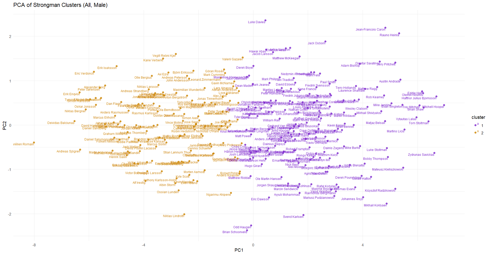

# Strength Trends in World's Strongest Man: Data-Driven Insights & Athlete Profiling

This repository contains the code and process used to scrape, clean, and extract data for strongman athletes, including their maximum lifts in a variety of competition exercises. The data was collected from [StrengthResults.com](https://strengthresults.com/statistics/profiles/cdcf-bbb4-4d7f-9306-26a3137e212e), focusing on extracting maximum recorded lifts for exercises of individual athletes. After filtering out teams and incomplete data, the final dataset contains records for 5,557 strongman competitors.

## Workflow Overview

The following steps were used to obtain and clean the data:

1. **Scraping Names and Birthdates (`NameScraper.py`)**  
   The first step was to scrape the names and birthdates of strongman athletes from the website, assuming that athletes listed with birthdates are more likely to have recorded maximum lifts available.
  
2. **Cleaning Names Data (`CleanNameData.py`)**  
   This script was used to remove any non-athlete entries, such as teams, from the list of scraped strongman names.

3. **Scraping Maximum Lifts (`Scraper.py`)**  
   Using Selenium, the script visited each athlete's profile page on StrengthResults.com. It searched for and scraped the maximum recorded lifts in various competition exercises for each athlete. The data was then saved in batches of 100 athletes per CSV file for easier handling.

4. **Cleaning the Data (`CleanData.py`)**  
   The data obtained from the scraping process was processed by:
     - Combining the CSV batches into a single dataframe.
     - Removing athletes who did not have any recorded lifts in any exercises.
     - Estimating the one-rep max (1RM) for events that had multiple repetitions.
     - Removing the pounds (lbs) measurement from the records to standardise the units.
  
## Results
  

